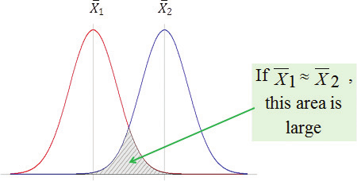

```{r setup, include=F}
knitr::opts_chunk$set(echo = TRUE,warning =F, message = F,eval=T)

```

$eval=F$ removes output from document

$echo=F$ removes code from document

```{r}
library('dplyr')
library('magrittr')
library('ggplot2')
```

# Taste of R

Consider an Analytic scenario where we load data into $R$

The provided data is separated using comma's, thus we'll use the $read.csv()$ function to read comma separated values.

We will employ the use of the the $readr$ to load data into $R$

```{r}
#Importing comma separated value file into R
sales<-read.csv("yearly_sales.csv")
# Examine imported dataset by viewing it's first 3 rows
head(sales)
# Get descriptive statistics of data set
summary(sales)
#Check structure of data ie; no. of rows and columns, data type of each column
str(sales)
#genarate a complete plot
plot(sales$num_of_orders,sales$sales_total,main="NUmber of Orders vs Sales")


```

$summary()$ is a generic function. This means that it performs different actions based on given arguments.

In data frames it gives descriptive statistics of the data set while in linear models it has a different functionality as we will see

High level plotting commands are used to generate a complete graph and by default they generate scatter plots unless given arguments state otherwise.

Low level plotting commands are used to add info to an already existing graph

Note that the $lm()$ function is used to get linear model or the fitted line of $Y=\beta_0+\beta_1X+\epsilon$, which is, $$
\hat{Y} = \hat{\beta_0} + \hat{\beta_1X}
$$

where

$Y$ is the observed Random Variable

$X$ is the observed non Random Variable

$\beta_0$ and $\beta_1$ are parameters, the intercept and slope respectively

$\epsilon$ is the residual or error ( The difference between actual $Y$ and observed $\hat{Y}$

$\epsilon=|Y-\hat{Y}|$

$\hat{Y}$ is the estimate or fit of $Y$

$\hat{\beta_0}$ and $\hat{\beta_1}$are the estimates or fits of $\beta_0$ and $\beta_1$ respectively

Let's plot a histogram of $results$ residuals, $\epsilon$

```{r}
#create a simple linear model
results<-sales %>% lm(sales_total~num_of_orders,data=.) 
summary(results)
results %$% hist(residuals,breaks=800)
```

The argument $breaks=$ is used to specify the intervals you want for your plot. Our chunk above has $800$ intervals

Let's use the chunk below with less data to show this

```{r}
data <- c(1, 2, 2, 3, 4, 5, 5, 5, 6, 7, 8, 9, 10)
# hsitogram wuth 2 intervals
hist(data, breaks = 4)
#
data %>% hist(.,breaks=seq(0,10,2))

```

When $breaks=2$ we have 2 intervals which can be $(1,5]$, $[5,10]$

When $breaks=seq(0,10,2)$ it means we have 5 intervals which have a step of 2 `zimeachana na mbili`. They include:

$[0,2)$ with one data point $1$

$[2,4)$ with 3 data points $2,2,3$

$[4,6)$ with 4 data points $4,5,5,5$

## $.RData$, $.RHistory$ and $.Rprofile$

1.  $.RData$

It stores the work space including loaded packages

This file is stored in the current working directory and you can specify it storage location by defining the pathway

```{r}
# saving the file
save.image()
#loading the file
load(".RData")
```

By default if no name is defined for the file, $R$ saves it as $.RData$

**Use Case**: Ideal for saving work space data to disk, which can be reloaded in future sessions.

```{r}
#saving the file with a name in Current dir
save.image("lec_3.RData")
#specifying pathway
save.image("/home/dave/Project/school_work/lec_3.RData")
#loading named file stored in current dir
load("lec_3.RData")
# loading named file with defined pathway
load("/home/dave/Project/school_work/lec_3.RData")
```

2, $.Rhistory$

It saves each and every code ran on the console and their output

By default $r$ asks you whether to save history upon exit

Just like $.RData$ you can give a name the the history file as well as define the pathway

When name is not give the file is saved as $.Rhistory$

Useful for keeping a record of all commands executed during an R session, which can be reloaded in future sessions for reference or repetition.

```{r}
#saving the history file
#savehistory("my_history.Rhistory")
# loading history file
#loadhistory("my_history.Rhistory")
```

3.  $.Rprofile$

It's purpose is to execute codes saved in it's file when starting an R session

# Data import and Export

## Importing

Data import is simply reading or loading data into R.

**NB:**

-   R uses forward slashes when specifying pathways

-   Pathways are enclosed in quotations

There's no need of specifying pathway if data to be loaded is in the same directory as the working directory

$setwd()$ is used to set working directory by specifying desired path directory as argument

```{r}
#Loading data by specifying pathway
sales<- read.csv("/home/dave/Project/school_work/yearly_sales.csv")
#setting working directory
setwd("/home/dave/Project/school_work")
#Loading data without pathway
sales<-read.csv('yearly_sales.csv');sales %>% head(3)

```

$read.table()$ and $read.delim()$ are used to read tabular files and delimiter separated values table respectively

They can also be used to load our data

```{r,eval=T}
sales_table<-read.table('yearly_sales.csv',header=T,sep=",")
sales_delim<-read.delim('yearly_sales.csv',sep=",") %>% head(3)
sales_table %>% head(3)
sales %>% head(3)
sales_delim %>% head(3)
```

When the argument $header=T$ , R assumes the 1^st^ row of your data to be the header

By default, R takes the 1^st^ row as header even without specifying the argument $header=T$ in the case of $read.scv()$ and $read.table()$ only

When you have decimal numbers separated by $,$ instead of $.$ $read.csv2()$ and $read.delim2()$ are used to read comma separated values and tab separated values respectively

## Exporting

Data exporting is using R to write the data elsewhere or to a new file of preference

```{r}
#add column for average sales per order
sales$per_order<-sales$sales_total/sales$num_of_orders
#adding same column using dplyr package
sales %>% mutate(per_order=sales_total/num_of_orders) %>% head(3)
#export data as tab delimited without row names 
write.table(sales,'sales_modified.txt',sep="\t",row.names=F)
```

We use the packages $DBI$ and $RODBC$ to read data from Database Management Systems (DBMS)

The packages use database interfaces for communication between R and Database management systems such as : $MySql$, $Oracle$, $SQl Server$, $PostgreSQL$ and $PIvotal Greenplum$.

```{r,eval=F}
install.packages("ROBDC")
library('ROBDC')
con<-obdcConnect('training2',uid="user",pwd='password')
```

## Ignore export for now

# Attributes

Attributes are the characteristics of data sets that provide the qualitative and quantitative measures of each item

They are of 4 types: Nominal, Ordinal, Interval, ratio

## Categorical/ Qualitative

Nominal and Ordinal attributes provides qualitative measures of each item

1.  **Nominal**
    -   **It's values are discrete and represent labels that distinguish one from the other eg: names, streets,**
2.  **Ordinal**
    -   **It's values are discrete represent labels that are different from each other and have an order eg; grades, quality of diamonds, magnitude of earthquake**

## Numeric/ Quantitative

Interval and ratio provides quantitative measures of each ite**m**

1.  **Interval**
    -   Values represents ordered units that have the same difference
2.  **Ratio**
    -   Values represents ordered units with the same proportion

Other Numeric attributes include:

-   **Discrete data**

    -   Values represents units that are distinct, separate and can be counted

eg: number of students in a class

-   **Continuous**

    -   Values represents units that are are not countable but can be measure

eg: height of students

# Data Types

Examples of data types include numeric, character, logic data types

```{r}
i<-1                #create a numeric variable
sport<-"football"   #create a character variable
flag<-TRUE          #create a logical variable

```

We have various functions to check the data type of various data in R

The $class()$ returns the data type of an object whilst the $typeof()$ determines the way an object is stored in R

```{r}
class(i) # returns numeric as it's data type is numeric
typeof(i) # returns a double, the way it's saved in R

class(sport) #returns a character
typeof(sport) #returns character

class(flag) #returns logical
typeof(flag) #returns logical
```

Only for numeric data types do we have a different way in which the object is stored

We have additional functions used to check data types and coerce objects into desired data types

```{r}
is.integer(i) # checks if 'i' is integer and if not returns false
j<-as.integer(i) # coerces 'i' into an integer
is.integer(j)
```

# Data Structures in R

## Vectors

A vector is a one dimensional data structure that stores data of the same type

The $is.vector()$ is used to check if object is a vector and the $as.vector()$ issued to coerce any object into a vector

$R$ assumes that single elements are vectors

```{r}
is.vector(i)
is.vector(flag)
is.vector(sport)
```

The concatenate function $c()$ is used to create vectors

```{r}
#using c() to create vector
u<-c('red','yellow','blue');u
#acces first element
u[1]
# create vector using :
v<-1:5;v


```

### Operations on vectors

```{r}
#summation of elements in v
sum(v)
# getting element wise squares of  elements in v
w<-v*2;w
#element wise addition of v and w
z<-w+v;z
# using relational operators to test conditions
z>8 # returns TRUE for elements greater than 5
#access elements greater than 8
z[z>8]
#access elements greater than 8 or less than 5
z[z>8|z<5]
```

The $vector()$ function by default creates a logical vector of a length specified in its argument

```{r}
#logical vector of length 3
a<-vector(length=3)
#logical vector of size 4
vector(length=4)
```

The $mode()$ argument is used to specify the data type of the vector

```{r}
b<-vector(mode='numeric',3)
b[2]<-3.1;b
dim(b)
```

$dim(b)$ returns $NULL$ as b has no dimensions

## Arrays and Matrices

A matrix is a 2 dimensional data structure that stores data of the same type.

An array is a data structure that can be 2 dimensional or 3 dimensional depending on the number of layers and stores different data types.

**NB:** A 2 dimensional array can be called a matrix

If it has one layer, it's a one dimensional data structure and if it has at least 2, then it's a 3 dimensional data structure

```{r}
a<-array(c(1,'a',T,4.6,5i,6,'a','b','c'),dim=c(3,3,1));a
```

```{r}
b<-data.frame(x=c(1,'a',T,4.6,5i,'b'));b
str(b)
```

Let's create an empty array and give it values by accessing through it's dimensions

```{r}
#create a 3 dimensional  array with 3rows, 4cols and 2 layers
(quarterly_sales<-array(0,dim=c(3,4,2)))
# add element to position in the dimensions of 2rows, 1col, 1 layer
(quarterly_sales[2,1,1]<-158000)

```

```{r}
#creating an empty matrix
(sales_matrix<-matrix(0,nrow=3,ncol=4))

```

The arguments $nrow()$ and $ncol()$ specify the number of rows and columns the matrix should have respectively.

#### Operations on Matrices

We can perform addition, subtraction, multiplication, and get the transpose and inverses of matrices

The package $matrixcalc$ provides functions used in matrix operations

```{r}
library('matrixcalc')
```

A matrix multiplied by it's inverse gives an identity matrix

```{r}
m<-matrix(c(1,3,3,5,0,4,3,3,3),nrow=3);m
m%*%matrix.inverse(m)
```

### Data Frames

A data frame is a 2 dimensional data structure that stores data of different types

An example of a data frame is the $yearly\_sales$ data set that we imported.

```{r}
is.data.frame(sales)
```

The `$` is used to access variables of 2 dimensional data structures

```{r}
length(sales$num_of_orders)
is.vector(sales$cust_id)
is.vector(sales$sales_total)
is.vector(sales$num_of_orders)
is.vector(sales$gender)
is.factor(sales$gender)
```

Let's make our variable gender to be an ordered factor with levels $M$ and $N$

```{r}
sales<-sales %>% mutate(gender=factor(gender))
summary(sales$gender)
#also use the code
sales$gender<-factor(sales$gender)
is.vector(sales$gender)
is.factor(sales$gender)

```

The chunk below is used to make the variable $gender$ a factor using $\$$

```{r}
sales$gender<-factor(sales$gender)
str(sales)
```

#### Accessing rows and columns in a data frame

The $[]$ and the $\$$ are used to access elements in objects where $\$$ accesses only named column variables

```{r}
#access the fourth column
#using integer index
sales[,4] %>% head(3)

#using string index
sales$gender %>% head(3)

#access rows 1,2,3
sales[1:2,] %>% head(3)

#access cols 1,3,4
sales[,c(1,3,4)] %>% head(3)

#access cols using character indices
sales[,c("cust_id","sales_total")] %>% head(3)

#accesing all records whose gender is female
sales[sales$gender=='F',] %>% head(3)

```

The class of sales is a data frame whilst it's type of is a list

```{r}
class(sales)
typeof(sales)
```

## List

A list is a 2 dimensional data structure with data of different types and stores its data in layers

A list can contain all other objects including itself in its layers

```{r}
#creating a list of a string,numeric, a lits, a vector, and a matrix
housing<-list('own','tent')
(assortment<-list('football',7.6,housing,v,m))
assortment[[1]]
assortment[[5]][2,3]
```

$[[]]$ is used to access the objects of a specified list whilst $[]$ is used to access the specified list

In the event that lists are named, we can use the \$\$ to access objects of a given list

We use $[[]]$ together with $[]$ in that order when we want to access elements of a list where $[[]]$ is used to specify list of interest and $[]$ is used to specify the index of an element of interest in the object of the specified list

If lists have names, then we can use \$\$ instead of $[[]]$

# [**Angalia page 77 base on chunk below..uliza lec**]{.underline}

```{r}
#check data type of fifth object
class(assortment[[5]]) # return a matrix or data frame

#check length of fifth object
length(assortment[[5]]) #returns 9(for the 3x3 matrix)

#access the type of fifth list
class(assortment[5]) #returns a list

#check size of fifth list
length(assortment[5]) 
```

$str()$ gives the structure of a data frame

```{r}
str(assortment)
```

## Factors

Factors are data structures that have data which are stored as labels that distinguish one from the other

The labels can be ordered units or nominal units

We can also refer to factors as data structures that stores categorical data as levels(labels)

Factors are of 2 types:

-   Nominal Factors

-   Ordinal Factors

## Nominal Factors

They are factors whose labels(levels) have no defined ordering

An example is our $yearly\_sales$ data set that has it's variable gender as a nominal factor

```{r}
#check data type of gender
class(sales$gender)

#check if gender is an ordinal factor
is.ordered(sales$gender) #returns FALSE

#Check the count(number of levels\labels) of gender
nlevels(sales$gender)

#returns the labels of gender
levels(sales$gender)

#display first 3 elements of our factor and its levels
sales$gender %>% head(3)
```

When checking if $gender$ is an ordinal factor $R$ returns false reason been that $gender$ is a nominal factor and not ordinal factor

## Ordinal Factors

They are factors whose levels/labels have a defined ordering

We can also say that the levels are in a given sequence and the latter level can't come before the current or earlier one

We'll use an inbuilt data set $diamonds$ to check out ordinal factors

```{r}
#load data in workspace
data(diamonds)

#check structure of diamond
str(diamonds)
glimpse(diamonds)
#x<-table()
```

Our data set $diamonds$ is a tibble.

A tibble can be referred to as a modified data frame that is better, efficient and more user friendly than a data frame

The $glimpse()$ is a function from dplyr has the same functionality as $str()$.

It is more efficient to to use $glimpse()$ to check the structure of a tibble

```{r}
#display first 6 values of ordered factor, cut and its levels
diamonds$cut %>% head(6)
```

## Suppose we want to categorize $sales\_totals$ into three groups— small, medium and large according to amount of sales.

In python this is called factor encoding

```{r}
# create an empty string vector of same size as length of sales_total 
(sales_group<-vector(mode="character",length=length(sales$sales_total)) %>% head(6))
#grouping customers according to sales amount
sales_group[sales$sales_total<100]<-'small'
sales_group[sales$sales_total>=100 & sales$sales_total<500]<-'medium'
sales_group[sales$sales_total>500]<-'big'
sales_group %>% head(6)
# create and add an ordered factors to sales data frame
spender<-factor(sales_group,levels = c('small','medium','big'),ordered = T)
sales$spender<-spender
#above 2 lines can also be written as
sales$spender<-factor(sales_group,levels = c("small","medium","big"),ordered=T)

str(sales)
sales$spender %>% head(6)
```

# Descriptive statistics

The $summary()$ function provides several descriptive statistics such as mean, median 1^st^ and 3^rd^ quantiles, minimums and maximums

When data has factors, it also gives the count of each label of the factors and arranges them in ascending alphabetical order if nominal and in the order of levels

```{r}
summary(sales)
```

```{r}
summary(diamonds)
```

Here are examples of some known functions that perform descriptive statistics in R

```{r}
x<-sales$sales_total
y<-sales$num_of_orders
#correlation
cor(x,y)
#covariance
cov(x,y)
#inter-quantile range of X
IQR(x)
#mean of x
mean(x)
#median of x
median(x)
#range of x
range(x)
#standard deviation of x
sd(x)
#variance of x
var(x)
```

The $apply()$ is used to map functions to objects

```{r}
sales[,c(1:3)] %>% apply(2,sd)
```

Let's create a user defined function that computes the difference between the maximum and minimum values

```{r}
max(x)
min(x)
max(x)-min(x)
my_range<-function(v) range(v)[2] -range(v)[1]
my_range(x)
```

# Contingency Tables

They are a class of objects used to store the observed counts across factors of a given data sets

Contingency tables form the basis of performing statistical test on independence of factors used to build the table.

Contingency table performs a chi square test on independence of factors and also provides p value

```{r}
#build contigency table based on gender and spender factors
(sales_table<-sales %$% table(gender,spender) )
class(sales_table)
typeof(sales_table)
dim(sales_table)
#performs a chi square text
summary(sales_table)

```

$summary()$ is used to perform a chi-square test $\chi{2}$ on independence of the factors

Since p-value is greater than 0.05, $0.4684>0.05$ we fail to reject the $H_0:Independence\ of\ the\ two\ factors$

# Exploratory Data Analysis(EDA)

EDA refers to the process of interacting with data in order to learn from it and understand its structure, extract important variables, detect outliers and anomalies, and test underlying assumption.

Examples EDA:

1.  Descriptive Statistics

Provides the magnitude and range of data but not its distribution and relationship of variables

2.  Data Visualization

Provides a succinct (provides important info in a conscious and easy to understand manner) and holistic (provides relationship between variables) view of the data

A scatter plot provides us with the relationship that exists between variables and and magnitude and direction of their correlation

```{r}
#generate random variables from  standardized normal dist size 50
x<-rnorm(50)
# generate random variables from normal dist mean 0, sd 0.5 and size 50 and add with x
y<-x+rnorm(50,0,0.5)
data<-data.frame(x,y)
#intercat with data with its descriptive stats
summary(data)
#interact with data using data visualuiztion, scatter plot
data %>% ggplot(aes(x=x,y=y))+
  geom_point(size=2)+
  ggtitle("Scatterplot for X and Y")+
  theme(axis.text=element_text(size = 12),
                  axis.title=element_text(size=14),
                  plot.title=element_text(size=20,face="bold"))

```

## Visualization Before Analysis

To emphasize the need of using data visualization instead of descriptive in EDA consider at the $anscombe$ data that has four data sets with closely related descriptive stats

$Ongezea\ corelation\ kwa\ code$

```{r}
summ=function(x){
  summarx<-data.frame()
  num_cols<-ncol(x)
  for(i in 1:(num_cols)){
    summary=data.frame(mean=mean(x[[i]]),var=var(x[[i]]),sd=sd(x[[i]]))
    
    rownames(summary)<-colnames(x)[i]
    summarx=rbind(summarx,summary)
    
    
  }
  return(summarx)
}
summ(anscombe)
```

The scatter plots of the data set give a different story from that of the descriptive statistics

Let's have the $anscombe$ in a plot to see what information it gives us

```{r}
anscombe %>% head(3)
nrow(anscombe)
# generat levels to indicate which group each data points belong to
(levels<-gl(4,nrow(anscombe)))
# Group anscombe into a data frame
mydata<-with(anscombe,data.frame(x=c(x1,x2,x3,x4),y=c(y1,y2,y3,y4),mygroup=levels))
mydata %>% head(3)
mydata %>% tail(3)
#make plots for the anscombe data
theme_set(theme_bw()) #set plot color theme
mydata %>% ggplot(aes(x,y))+
  geom_point(size=4)+
  geom_smooth(method = "lm",fullrange=T,fill='red')+
  
  facet_wrap(~mygroup)


```

The $gl)$ is used to create levels.

It has the arguments $n$ and $k$ which are the number of levels and the number of repetitions respectively in our case we want 4 levels repeated 11 times to cater for each and every data point

check more arguments using $gl()$

the $with()$ is used to evaluate expressions in a local environment constructed from the data

It takes the arguments $data$ and $expr$ where $data$ is the data frame and $expr$ refers to variables of the data frame

```{r}
df <- data.frame(x = 1:5, y = 6:10)

# Without with()
(result <- (df$x + df$y) / 2)

# With with()
(result <- with(df, (x + y) / 2))

```

The $fill=$ is used to specify the color of the shaded region when fitting a straight line to a scatter plot which represents the confidence interval

$fill=Na$ means that no color is applied to the confidence interval and thus is removed

The $fullrange=T$ argument tells R that the fitted line should go across the plot and not end at the last data point

## Dirty Data

Soma badae

## Visualizing Single Variables

Here we are dealing with uni-variate plots

These are plots with one variable and are used to examine a single variable

### Dot-chart and Bar-plot

Dot-chart and bar-plot display (portray) continuous values with labels from discrete variables

1.  **SYNTAX:**

$dotchart(x,\ label=...)$

$x$ is the numeric vector or matrix and $label$ is a vector of categorical labels for $x$

```{r}
data("mtcars")
mtcars %$% dotchart(mpg,labels=rownames(mtcars),cex=.7,main = "Miles Per Gallon (MPG) of car Models",xlab = "MPG")
```

$cex$ used to define the character size of labels to be used.. Having it less than 1 ensures that labels don't overlap each other

2, **SYNTAX**

$barplot(height)$

$height$ represents a vector or matrix

Note that a bar-plot shows how many x are in y

It is more of uni-variate than a multi-variate plot

```{r}
mtcars %$% barplot(table(cyl),main = "Distribution of Car Cylinder Counts",xlab="Number of Cylinders")
mtcars$cyl
```

### Histogram and Density plots

A Histogram is used to display the frequency distribution of a variable using bars whereas the density plot displays frequency distributions using curves

```{r}
#generate 4000 observations from log normal distribution
income<-rlnorm(4000,meanlog = 4,sdlog = 0.7) 
summary(income)
income<-1000*income 
summary(income)
#plot Histogram
hist(income,breaks = 500,xlab="Income",main = "Histogram of Income")
#density plot
plot(density(log10(income), adjust=0.5),
main="Distribution of Income (log10 scale)")

#add rug to density plot
rug(log10(income))

```

```{r}
as.data.frame((income)) %>% ggplot(aes(x=(income)))+
  geom_density(adjust=.5,col="green")+
  theme(plot.background = element_blank())+
  geom_rug()

```

The $rug()$ portrays ticks on x or y- axis as specified to represent exact data points in a plot.

Let's user lesser data to see this

```{r}
hist(iris$Sepal.Length,main="Histogram of Sepal Length with Rug Plot",col="lightblue",border="red",xlab= "Sepal Length")
rug(iris$Sepal.Length)
# try looking for ticks representing the first 6 values of Sepal.Length
iris$Sepal.Length %>% head()
```

If data is skewed and it's points are positive and the data has a huge volume, then it makes sense to use a logarithmic scale so as to see structures that are overlooked when using a regular( arithmetic) scale.

Examining if data is uni-modal(1 mode) or multimodal( more than 2 modes) may give an idea about how many distinct populations with different behavior patterns may be mixed in the overall population

# Tengeneza code ioonyeshe graphs za log scale na arithmetic scales

```{r}
#create a factor with 2 levels and a length same as income variable
levels<-gl(2,length(income))
x<-data.frame(income,log10(income))
#convert data to long data
y<-with(x,data.frame(x=c(income,log10(income)),mylevels=levels))
y %>% head(3)
y %>% tail(3)
y %>% ggplot(aes(x,fill=mylevels))+
  geom_density()+
  facet_wrap(~mylevels)

```

To emphasize more on need of using logarithmic scale for huge data sets,,

consider the $diamonds$ data set that has different prices for cuts rated as $Fair\ Good\ Very\ Good\ Premium\ Ideal$

We'll only focus on the $Premium\ Ideal$ cuts

```{r}
#data is from ggplot
data(diamonds)
#keep Premium and Ideal cuts only
niceDiamonds<-diamonds[diamonds$cut=="Premium"|diamonds$cut=="Ideal",]
summary(niceDiamonds$cut)
#density plot with regular scale
niceDiamonds %>% ggplot(aes(x=price,fill=cut))+
  geom_density(alpha=.5,col=NA)+
  scale_fill_manual(values = c("green","red"))
  
```

In $ggplot$ the arguments $fill,\ col,\ alpha$

are used to provide color for the plotted objected, color for the outline of plotted object and define opaqueness of different object colors that are on top of each other

-   `alpha = 0`: Fully transparent (invisible).

-   `alpha = 1`: Fully opaque (no transparency).

In basic plots that are inbuilt in $R$, arguments $fill$ and $color$, $col$ and $border$ have same functionality.

Using regular scale, we see that there's only one distinct price(about 794\$) group for Ideal cuts and 2 distinct groups(about 794 and for Premium cuts

```{r}
niceDiamonds %>% ggplot(aes(x=log10(price),fill=cut))+
  geom_density(alpha=.3,color=NA)+
  scale_fill_manual(values=c("green","red"))
```

The plot with a logarithmic scale gives more details on the diamond price

For instance we have 3 distinct prices for ideal cuts at point

## Examining multiple variables

A scatter plot can be used to check relationship among multiple variables

It can represent data with up-to 5 variables using the x,y-axis, size, color and shape.

By examining data carefully, you can know the relationship that exists between given variables

The relationship can be linear, parabola (A parabola of order to is a quadratic), exponential

NB if plots look more like a cluster and not a pattern, then variables may have weak relationships.

The $loess()$ is used to fit non-linear lines to a given data set

```{r}
#generate random uniform values of length 75 and range 0,10
x <- runif(75, 0, 10)
#arrange vector x is ascending order
x <- sort(x)
#create a parabola/polynomia of order 3
y <- 200 + x^3 - 10 * x^2 + x + rnorm(75, 0, 20)
#create a linear model
lr <- lm(y ~ x)
#create a non linear model
poly <- loess(y ~ x)
#fit a non linear line
fit <- predict(poly)

plot(x,y)
# draw the fitted line for the linear regression
points(x, lr$coefficients[1] + lr$coefficients[2] * x,
type = "l", col = 2)
# draw the fitted line with LOESS
points(x, fit, type = "l", col = 4)
```

Note that:$$
lr\$coefficients[1]\ +\ lr$coefficients[2]*x\ = \hat{B_0}\ +\ \hat{B_1x}
$$

The $points()$ draws a sequence of points at specified coordinates.

The \$predict() \$function in R is used to make predictions based on a model that has been fitted to data

```{r}
x<-1:10
y=200+x^3-10*x^2+x
fit<-lm(y~x)
(fitted_values<-predict(fit))
```

Table below shows the process of above chunk

+----+------------------------------------+--------------------+
| x  | Actual values: $y=200+x^3-10x^2+x$ | fitted values:     |
|    |                                    |                    |
|    |                                    | $$                 |
|    |                                    | \hat{y}=142.8-3.6x |
|    |                                    | $$                 |
+====+====================================+====================+
| 1  | 192                                | 139.2              |
+----+------------------------------------+--------------------+
| 2  | 170                                | 135.6              |
+----+------------------------------------+--------------------+
| 3  | 140                                | 132.0              |
+----+------------------------------------+--------------------+
| 4  | 108                                | 128.4              |
+----+------------------------------------+--------------------+
| 5  | 80                                 | 124.8              |
+----+------------------------------------+--------------------+
| 6  | 62                                 | 121.2              |
+----+------------------------------------+--------------------+
| 7  | 60                                 | 117.6              |
+----+------------------------------------+--------------------+
| 8  | 80                                 | 114.0              |
+----+------------------------------------+--------------------+
| 9  | 128                                | 110.4              |
+----+------------------------------------+--------------------+
| 10 | 210                                | 106.8              |
+----+------------------------------------+--------------------+

The scatter plot shows that our data set has a parabola relationship between its response and regressor variables as the parabola curve passes through most of the data points

# ulizia kuhusu loes

## Dot-chart and Bar-plot

Just as stated above,the two are used to plot continuous data with labels from discrete\\categorical variables

Let's have a dot-chart that groups vehicle cylinders at y-axis and distinguish them with different colors

```{r}
#sort by mpg
cars<-mtcars[order(mtcars$mpg),]
#the groping variable must be a factor
mtcars$cyl<-factor(mtcars$cyl)

cars$color[cars$cyl==4]<-"red"
cars$color[cars$cyl==6]<-"blue"
cars$color[cars$cyl==8]<-"darkgreen"

#plotting dotchart
cars %$% dotchart(mpg,labels=rownames(cars),cex=.7,groups=cyl,
                  main="Miles Per Gallon (MPG) of Car Models\nGrouped by Cylinder",
                  xlab="Miles Per Gallon",color = color,gcolor="black") 
```

The $order()$ is used to sort indices in ascending order starting with the index that has the smallest value and ending with index that has highest value

In the chunk we use order to sort indices of the variable $mpg$ then use this indices for accessing of rows in the $mtcars$ data set

## Bar plot

Let's have a bar plot that give the number of counts of cylinders grouped by the number of gears

```{r}
counts<-table(mtcars$gear,mtcars$cyl)
barplot(counts,main="Distribution of Car Cylinders Counts and Gears",
        xlab="Number of Cylinders",
        ylab="Counts",
        col=c("#0000FFFF","#0080FFFF","#00FFFFFF"),
        legend=rownames(counts),
        beside=T,
        args.legend = list(x="top",title="Number of Gears"))
```

# Statistical Methods for Evaluation

Statistical techniques are used in initial data exploration, data preparation, model building, evaluation of existing models and assessment of new models( are they more effective)

## Hypothesis Testing

It is a technique of assessing the statistical significance difference of models or populations.

The hypothesis tested are 2:

1.  Null hypothesis $H_0$
    -   It's the initial status ( the known status-quo)

    -   We mostly define $H_0$ as having the two models or population been equal

    -   $H_0$ can be defined in other ways depending on the question of interest
2.  Alternative Hypothesis $H_1$
    -   It's the contradictory status of $H_0$

    -   It trys to prove that the initial status quo is not what we think or belie.

    -   For Instance, $H_1$ can be that models or samples are not equal.

Let's dive into some examples on hypothesis testing

### 1. Difference of means

Consider a 2 sample test on mean where variance is unknown

$$
H_0:\mu_1=\mu_2\\ H_1:\mu_1\ne mu_2
$$

We fail to reject $H_0$ when a given test statistics is in the acceptance region



In the diagram above, the shaded region is our acceptance region and it clearly shows that the means of the two samples $X_1$ and $X_2$ are equal

We use the t-test or Welch's test to test this hypothesis

#### student's t-test

The test assumes that our populations have equal but unknown variances

Consider 2 populations,

$$
X_1\sim \mathcal{N}(\mu_1,\sigma^2),\ X_2\sim\mathcal{N}(\mu_2,\sigma^2)
$$

We assume $n_1+n_2-2$ degrees of freedom as 2 parameters are required in estimation of $\hat{y}$

Our t-test statistics(computed t) is given by: $t=\frac{\bar{X_1}-\bar{X_2}}{S_p\sqrt{\frac{1}{n_1}+\frac{1}{n_2}}}\sim\mathcal{t}(n_1+n_2-2)$,

Where $S_p^2$ is pooled variance and is given by : $S_p=\frac{(n_1-1)S_1^2-(n_2-2)S_2^2}{n_1+n_2-2}$

We reject the $H_0$ when $|t|>t_\frac{\alpha}{2}(n_1+n_2-2)$, where

$t_\frac{\alpha}{2},(n_1+n_2-2)$ is the tabulate t-statistics and $\alpha$ is the significance level which is the probability of rejecting $H_o$ when true

Let's implement in R

```{r}
#generate random obs for 2 populations
x<-rnorm(10,100,5)
y<-rnorm(20,105,5)
#find computed  t
t.test(x,y,var.equal=T) 
#find tabulated t
qt(p=0.05/2,df=28,lower.tail = F)
```

We fail to reject $H_0$ since $|t|<t_{0.025}(28)$

$\alpha$ is divide by 2 as our hypothesis is a `2-sided hypothesis test` ($H_1:\mu_1\ne\mu_2$)

Consider a 1 sample test

$X\sim\mathcal{N}(\mu,\sigma^2)$, we want to test the hypothesis:

$H_0:\mu=\mu_0\ vs\ H_1:\mu\ne\mu_0$

Test statistics is given by :

$t=\frac{\sqrt{n}(\bar{X}-\mu_0)}{S_x}\sim\mathcal{t}(n-1)$, where $S_x^2=\frac{1}{n}\sum{(X_i-\bar{X})^2}$

$H_0$ is rejected when $|t|>t_\frac{\alpha}{2},(n-1)$

```{r}
a<-c(5.71,5.80,6.03,5.87,6.22,5.92,5.57,5.83)
t.test(a,mu=5.70)
qt(p=0.05/2,df=7,lower.tail=F)
```

By default $R$ assumes variances of 2 populations are equal

The above code is testing the hypothesis: $H_0:\mu=5.70\ vs\ H_1:\mu\ne5.70$

Since $|t|=2.4183>t_{0.025}(7)=2.364624$ we reject $H_0$

the p-value is obtained by: $\mathcal{2p(T>2.4183})$

We also reject $H_o$ when $p-value<\alpha$ (applies for both) and when $\mu_0$ is not in the Confidence interval (applies for one sample test)

#### Welch's t-test

It is used to test significance difference of means when the variance of populations is not same and is unknown.

It's test statistics is given by

$$
t=\frac{\bar{X_1}-\bar{X_2}}{\sqrt{\frac{S_1^2}{n_1}+\frac{S_2^2}{n_2}}}
$$

The Welch's test uses sample variance for each population rather than the pooled variance of both populations

It's test statistics follows a t-distribution where the degrees of freedom are computed as follows:

$$
df=\frac{[\frac{S_1^2}{n_1}+\frac{S_2^2}{n_2}]^2}{\frac{[\frac{S_1^2}{n_1}]^2}{n_1-1}+\frac{[\frac{S_2^2}{n_2}]^2}{n_2-1}}
$$

Confidence intervals are the estimate intervals of the population parameter.

When the value of an estimator(point estimator) lies within the confidence interval, it means that the is a reasonable estimate of the population parameter

Also, when the estimate lies within this interval, it means that the given data support $H_0$

Confidence Intervals can be used for

1.  Precision:

    \` The smaller the CI the more precise the estimate of a population parameter is.

2.  Inference

    -   CI can be used to make probabilistic statements on population parameter rather than relying on the point estimate only

```{r}
#value of x and y is from previous chunk
t.test(x,y,var.equal=F)
#get tabulated t
qt(p=0.05/2,df=16.495,lower.tail=F)
```

#### Wilcoxon Rank-Sum-Test
